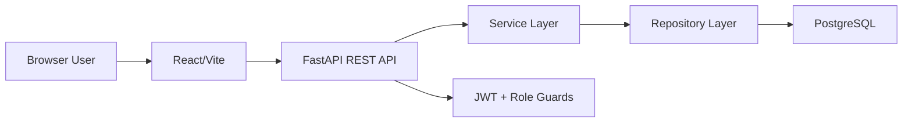

# Architecture

Lumin follows a modular service-oriented backend and a reusable component frontend.

## Backend Layers

- `api/routes`: HTTP boundaries, request/response models and role guards.
- `services`: business rules for auth, attempts, XP and statistics.
- `repositories`: query and persistence operations.
- `models`: SQLAlchemy entities and relationships.
- `schemas`: Pydantic contracts.
- `db/seed.py`: deterministic demo data.

## Frontend Layers

- `pages`: route-level screens.
- `layouts`: authenticated shell and navigation.
- `components`: reusable UI primitives.
- `store`: centralized auth state.
- `api`: Axios client with token injection.
- `data`: fallback demo data for polished offline rendering.

## Runtime Flow

## Clean Architecture Notes

Routes stay thin and delegate domain behavior to services. Services do not know HTTP details except explicit exceptions at boundary checks. Repository classes centralize SQLAlchemy queries so pagination, filtering and eager-loading can evolve without leaking persistence details into UI concerns.
