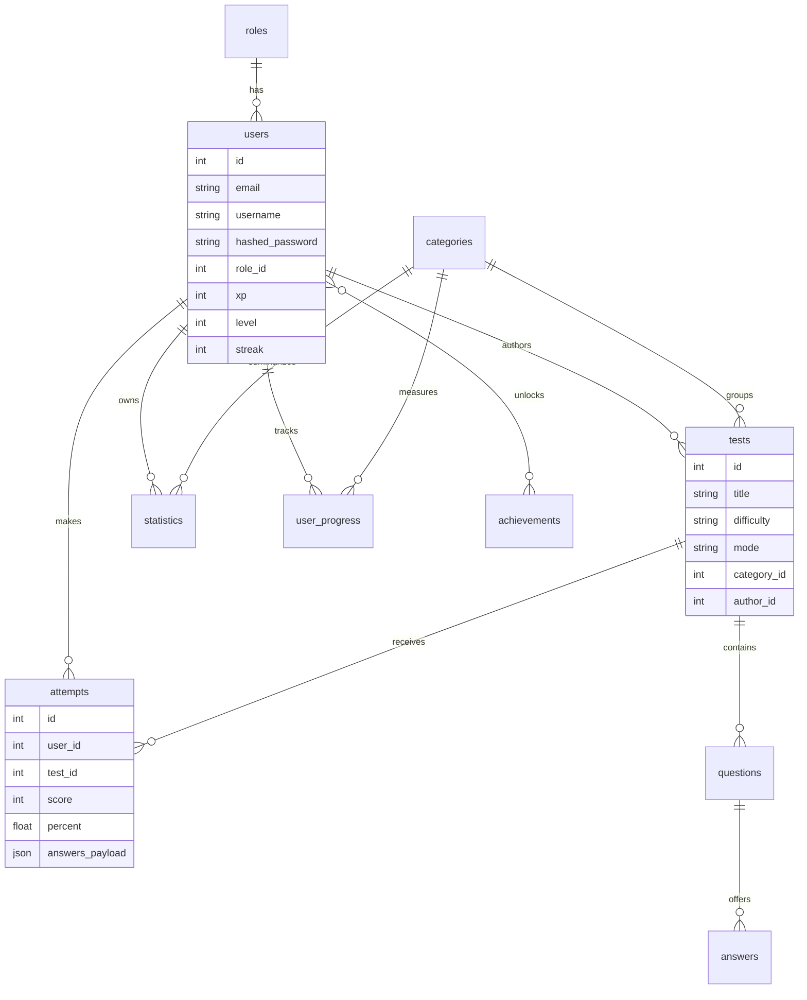

# Database Schema

Alembic migration `0001_initial_schema.py` creates all required tables:

- `users`
- `roles`
- `tests`
- `categories`
- `questions`
- `answers`
- `attempts`
- `statistics`
- `achievements`
- `user_progress`
- `user_achievements`
